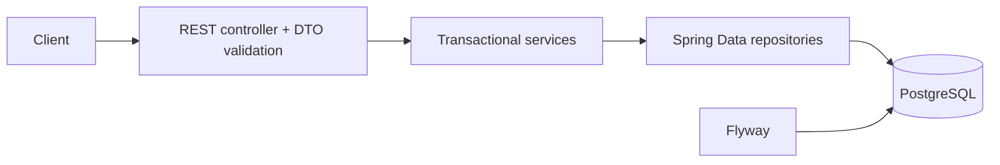

# Architecture

Controllers translate HTTP and never expose entities. Services own use-case rules. Repositories contain persistence details, including the pessimistic inventory lock. Flyway owns schema creation; Hibernate runs with `ddl-auto=validate`.

For reservation creation, one transaction validates all products, sorts product UUIDs, locks corresponding inventory rows, validates all quantities, decrements stock, and inserts the reservation/items. Sorting gives competing multi-product requests a consistent lock order and reduces deadlock risk. Cancellation/expiration similarly locks inventory rows before releasing stock. Reads use read-only transactions where lazy entity navigation requires a persistence context.

The service is deliberately a modular monolith. A failure anywhere in the creation use case rolls back all stock changes. The guarantee is scoped to transactions using the same PostgreSQL database; there is no distributed transaction claim. Pessimistic locking makes contested requests wait and is less scalable for extremely hot SKUs, but is more straightforward than retries and version-conflict behavior for this bounded project.
