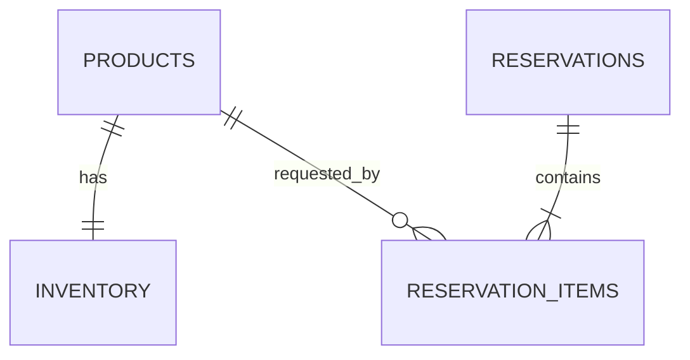

# Database

- `products`: UUID key, unique SKU, nonblank name, creation timestamp.
- `inventory`: product UUID is both PK and FK; `available_quantity >= 0` is enforced by PostgreSQL.
- `reservations`: UUID key and checked lifecycle status.
- `reservation_items`: positive quantity, FKs to reservation/product, unique product per reservation.

Indexes support unique SKU lookup, reservation status lookup, and reservation-item product access. Foreign keys define cascade/restrict behavior explicitly. `V1__create_inventory_schema.sql` is deterministic and runs against an empty database through Flyway. Production configuration uses `hibernate.ddl-auto=validate`, so ORM startup checks but never invents the schema.
